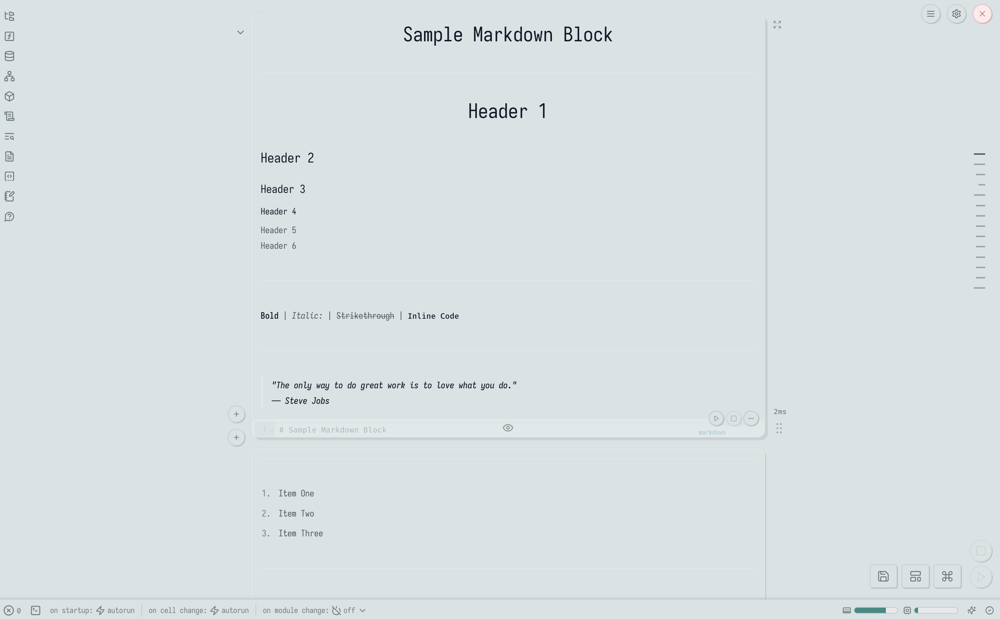
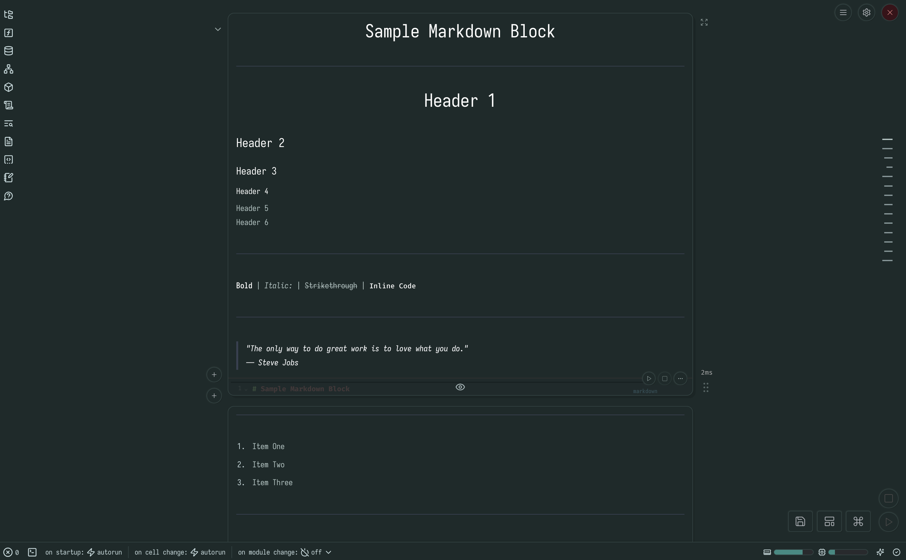
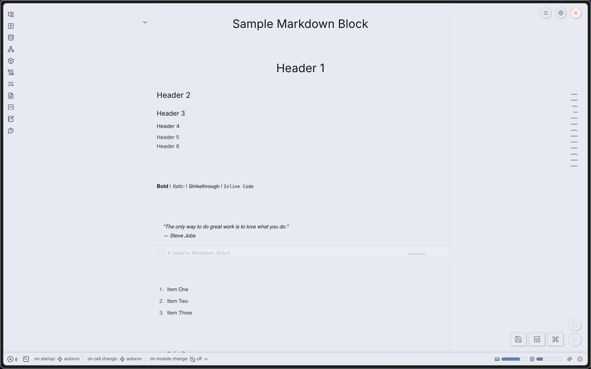
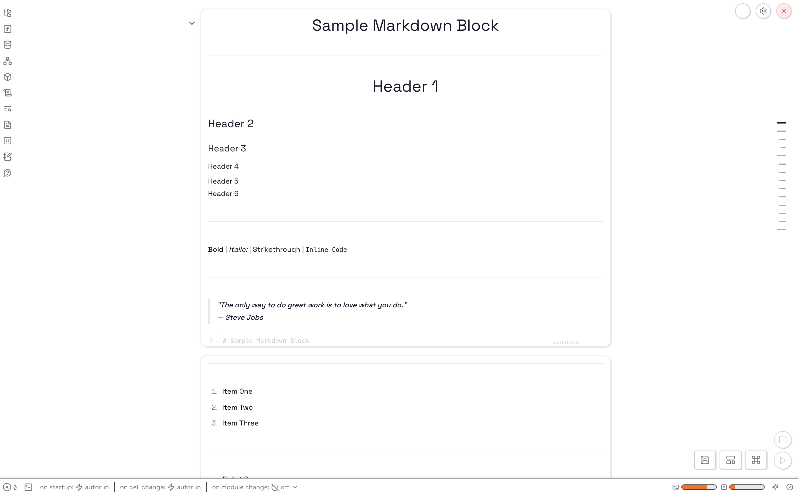
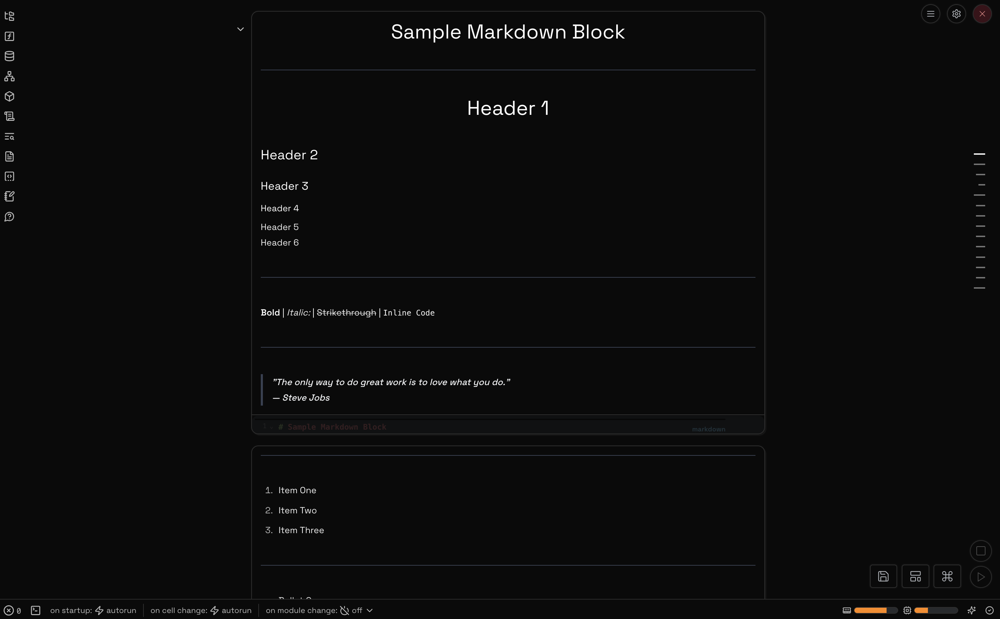
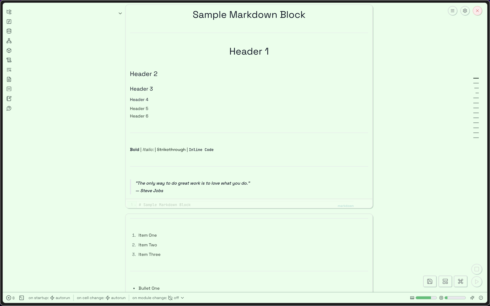
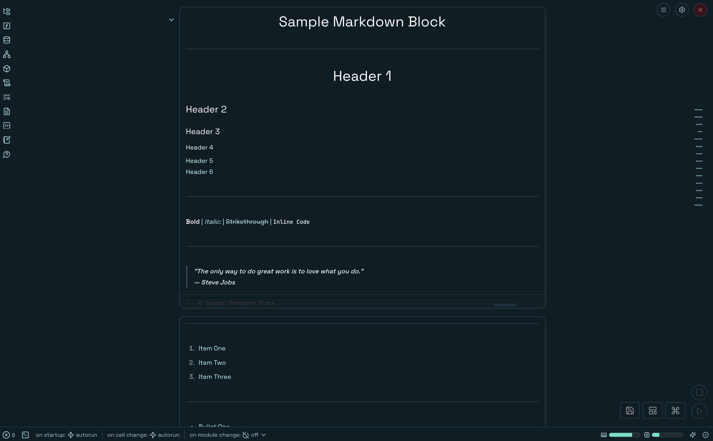

# Marimo Custom Themes

> personalize your experience with
> [marimo](https://github.com/marimo-team/marimo)

## Theme Gallery

### <a href="themes/coldme/">coldme</a>

    
    

### <a href="themes/nord/">nord</a>

    
    

### <a href="themes/mininini/">mininini</a>

    
    

### <a href="themes/wigwam/">wigwam</a>

    
    

## Notice

Please note that some parts of the Marimo notebook are not fully exposed for
customization at this time. This includes background colors of side panels,
cell editors, and the menu. These features may be exposed in a later version of
Marimo, allowing for more extensive theme customization.

## Usage

-   **Requirements**: Ensure you are using Marimo version **0.8.4** or higher,
    as custom CSS support was introduced in this version. It is recommended to
    keep your Marimo version up-to-date for the best experience.

-   **Navigating Themes**: Go to the `themes` folder to preview the themes
    using the provided screenshots. You can directly download the CSS files and
    place them in a suitable path in your project. To include a custom CSS file
    inside a notebook, go to the configuration dropdown and add the relative
    file path to your CSS file in the **Custom CSS** field. Once saved, you
    should see the changes applied to your notebook.

-   **Light and Dark Mode Support**: All themes support both light and dark
    modes and will switch automatically based on your notebook's current theme
    settings.

## Contributing

To contribute your own themes, please follow these guidelines:

-   **Refer to Default Arguments**: All available arguments are listed in
    [`default.css`](default.css), which serves as a reference for writing your
    themes. You can experiment with other arguments, but please note that
    stability cannot be guaranteed with untested changes.

-   **Light and Dark Themes**: Implement both light and dark themes using the
    light-dark syntax as demonstrated in `default.css`. If you choose not to
    implement a theme for a specific mode, name your theme as `xxx_light` or
    `xxx_dark` and use the default values for the respective mode from
    `default.css`.

-   **Folder Structure**: After finishing your CSS file, create a new folder
    inside `themes` with the name of your theme. Within this folder, upload the
    following:

    -   The CSS file
    -   Preview images
    -   An optional `README.md` file to illustrate your design

-   **Design Using Sample**: You can design your theme using the
    [`sample.py`](sample.py) file provided in the repository. This file helps
    visualize how your theme will look in the Marimo notebook.
